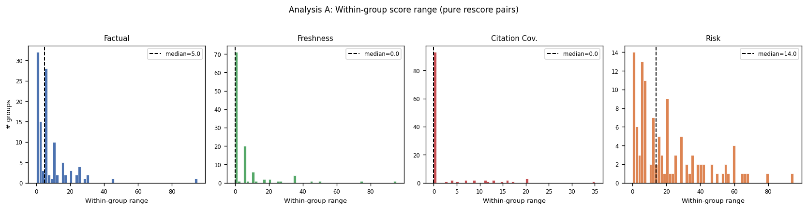
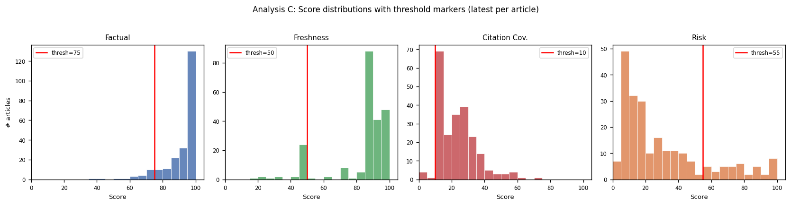
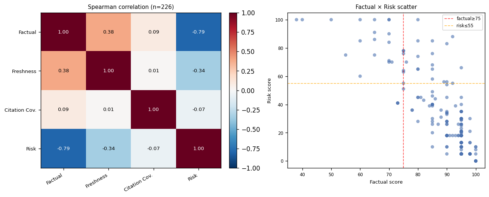
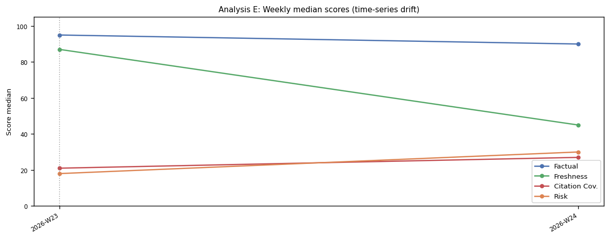
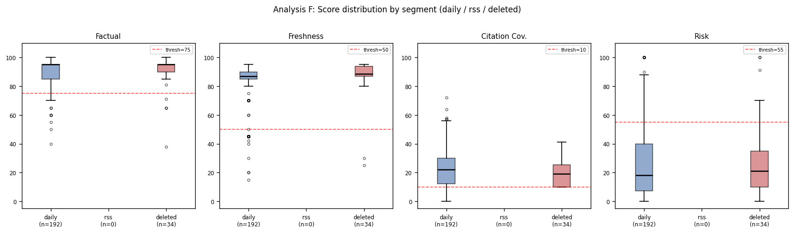

# Fact Check Scorer Audit Report

生成: 2026-06-21T07:39:47Z

## 1. 実行情報

| 項目 | 値 |
|------|----|
| 期間 | (全期間) 〜 (全期間) |
| JSONL 総レコード数 | 464 |
| 分析対象 (status=ok) | 427 |
| 除外: fact_check_unavailable | 27 |
| 除外: failed_fact_check | 7 |
| hash 不一致再採点ペア (除外) | 14 paths |
| 使用モデル (主分析) | gemini-2.5-flash |
| モデル混在 | ⚠️ gemini-2.5-flash=461; gemini-2.5-flash-lite=3 |
| prompt_version 混在 | なし |
| 削除済み記事 (データには残存) | 66 |

## 2. 結論

- **再現性**: グレーゾーン多数決を検討 (5-15)
- **判別力(フリップ率)**: 多数決導入を検討 (10-25%)
- **実行健全性**: 5.8% unavailable — エラー詳細は分析G参照

## 3. 主要指標

| 指標 | 値 | 判定基準 | 判定 |
|------|----|----------|------|
| factual レンジ中央値 | 5.0 | <5 安定 / 5-15 グレー / >15 要見直し | グレーゾーン多数決を検討 (5-15) |
| フリップ率 | 15.8% | <10% 安定 / 10-25% 多数決 / >25% 再設計 | 多数決導入を検討 (10-25%) |
| グレーゾーン率 | 17.7% | — | — |
| 軸間最大|ρ| | なし | >0.8 = 冗長候補 | ✅ |
| unavailable 率 | 5.8% | <5% 正常 | ⚠️ |
| 実質無機能軸 | Citation Cov. | なし = 正常 | ⚠️ 要確認 |

## 4. 各分析の要約

### A. 再採点分散

純粋再採点グループ数: **114**（同一記事・同一本文の複数採点）

| 軸 | レンジ中央値 | p90 | 最大 | std中央値 |
|----|-------------|-----|------|----------|
| Factual | 5.0 | 20.0 | 95.0 | 2.2 |
| Freshness | 0.0 | 19.1 | 95.0 | 0.0 |
| Citation Cov. | 0.0 | 11.0 | 35.0 | 0.0 |
| Risk | 14.0 | 54.4 | 95.0 | 6.5 |

**factual レンジ最大5記事:**
- `auto_2026-06-12_fixing-ghcr-unauthorized-docker-cannot-perform-int.md` factual_range=95.0  [Factual=[0.0, 95.0], Freshness=[0.0, 95.0], Citation Cov.=[10.0, 23.0], Risk=[0.0, 13.0]]
- `docker_429.md` factual_range=45.0  [Factual=[95.0, 50.0], Freshness=[90.0, 15.0], Citation Cov.=[29.0, 29.0], Risk=[5.0, 100.0]]
- `ansible_500.md` factual_range=30.0  [Factual=[95.0, 65.0], Freshness=[90.0, 95.0], Citation Cov.=[14.0, 10.0], Risk=[28.0, 75.0]]
- `aws_409.md` factual_range=30.0  [Factual=[65.0, 95.0], Freshness=[90.0, 90.0], Citation Cov.=[10.0, 10.0], Risk=[65.0, 5.0]]
- `aws_404.md` factual_range=28.0  [Factual=[98.0, 70.0], Freshness=[87.0, 87.0], Citation Cov.=[17.0, 17.0], Risk=[5.0, 84.0]]

### B. 合否フリップ率

純粋再採点グループ 114 件中、判定が変わったグループ: **18 件**
フリップ率: **15.8%** → 多数決導入を検討 (10-25%)

反転の主因となった軸:
- Factual: 10 件 (56%)
- Freshness: 4 件 (22%)
- Risk: 15 件 (83%)

> ⚠️ スコア再計算 vs overall_judgement の不一致: **61 件** — judgement に独自ロジックが存在する可能性

### C. しきい値感度・グレーゾーン

最新レコード使用: 226 件

⚠️ **実質無機能の軸** (合格率 >95%): Citation Cov.

| 軸 | 中央値 | 合格率 | グレーゾーン率 |
|----|--------|--------|--------------|
| Factual | 95.0 | 90.7% | 8.8% |
| Freshness | 87.0 | 85.8% | N/A |
| Citation Cov. | 22.0 | 97.8% | N/A |
| Risk | 18.0 | 82.7% | 10.6% |

### D. 軸間相関 (Spearman)

n=226 件（最新レコード）
冗長ペアなし (|ρ|≦0.8)

| | Factual | Freshness | Citation Cov. | Risk |
|---|---|---|---|---|
| Factual | 1.000 | 0.384 | 0.093 | -0.794 |
| Freshness | 0.384 | 1.000 | 0.014 | -0.341 |
| Citation Cov. | 0.093 | 0.014 | 1.000 | -0.066 |
| Risk | -0.794 | -0.341 | -0.066 | 1.000 |

### E. 時系列ドリフト

週数: 2  （現時点のデータ期間が短いため、将来の監査に向けた枠組みとして出力）
変化点: model=gemini-2.5-flash-lite at 2026-06-12T07:48:20Z

### F. セグメント別分析

**daily** (n=192)
**rss** (n=0)
**deleted** (n=34)

**仮説検証:**

① risk 軸は不適格(deleted)群で高いか？
  - deleted 中央値=21.0 (n=34), daily=18.0, rss=N/A
  → deleted > daily (**仮説支持**) ※ n が小さいため解釈は慎重に

② factual 軸は不適格群を検出できるか？
  - deleted 中央値=95.0 (n=34), daily=95.0, rss=N/A
  → deleted ≈ daily (**仮説不支持** — fact check は適格性の防衛線にならない疑いあり。n=34)

**ツール別スコア中央値 (n≥3のみ):**

| ツール | n | Factual | Freshness | Citation | Risk |
|--------|---|---------|-----------|----------|------|
| AWS | 11 | 95.0 | 87.0 | 17.0 | 18.0 |
| Ansible | 6 | 91.0 | 90.0 | 18.5 | 22.0 |
| Azure | 8 | 95.0 | 87.0 | 22.5 | 24.0 |
| Bitbucket | 3 | 95.0 | 90.0 | 31.0 | 18.0 |
| CircleCI | 4 | 84.5 | 45.0 | 13.5 | 52.0 |
| Docker | 12 | 95.0 | 87.0 | 29.0 | 22.0 |
| Docker Compose | 8 | 95.0 | 90.0 | 10.0 | 21.5 |
| Firebase | 12 | 93.0 | 90.0 | 24.0 | 5.0 |
| GCP | 8 | 95.0 | 92.5 | 13.0 | 16.5 |
| GitHub API | 11 | 89.0 | 87.0 | 41.0 | 40.0 |
| GitLab | 8 | 93.5 | 90.0 | 31.0 | 27.0 |
| Jenkins | 6 | 94.0 | 45.0 | 28.0 | 18.0 |
| Kubernetes | 6 | 95.0 | 92.5 | 25.5 | 5.0 |
| Minikube | 6 | 95.0 | 88.5 | 13.5 | 5.0 |
| Nginx | 7 | 95.0 | 87.0 | 26.0 | 21.0 |
| OpenAI API | 10 | 89.0 | 75.0 | 31.0 | 33.0 |
| Podman | 6 | 95.0 | 87.0 | 11.5 | 14.0 |
| Postman | 5 | 85.0 | 70.0 | 19.0 | 36.0 |
| Prometheus | 3 | 90.0 | 45.0 | 34.0 | 28.0 |
| Slack | 6 | 95.0 | 88.5 | 27.0 | 18.0 |
| Stripe | 7 | 95.0 | 87.0 | 22.0 | 13.0 |
| Supabase | 8 | 95.0 | 90.0 | 21.5 | 5.0 |
| Terraform | 7 | 95.0 | 87.0 | 18.0 | 13.0 |
| Vercel | 8 | 95.0 | 87.0 | 25.0 | 18.0 |
| deleted | 45 | 95.0 | 87.0 | 19.0 | 26.0 |
| tool-guide | 4 | 77.5 | 65.0 | 10.0 | 56.5 |

### G. 実行健全性

| status | 件数 | 割合 |
|--------|------|------|
| fact_check_unavailable | 27 | 5.8% |
| ok | 430 | 92.7% |
| failed_fact_check | 7 | 1.5% |

**error_detail 頻度上位:**
- `gemini`: 17 件
- `json_parse_error`: 6 件
- `gemini_error`: 3 件
- `empty`: 1 件
- `GEMINI_API_KEY`: 1 件

**URL チェック結果** (総ソース 13765 件):
- 200: 9128 (66.3%)
- skipped: 4627 (33.6%)
- 247: 6 (0.0%)
- 202: 4 (0.0%)
- grounding URL (vertexaisearch等): 9285 (67.45%)

unsupported_claims / 記事: 中央値=1.0, 最大=20

## 5. 推奨アクション

- ⚠️ factual レンジ中央値 5-15 → **新記事ゲートの3回採点・多数決化**を推奨
- ⚠️ フリップ率15.8% → **多数決採点の導入**を推奨
- ⚠️ 実質無機能軸 (Citation Cov.) → しきい値の見直しまたは軸の廃止を検討
- ⚠️ factual 軸が不適格群(deleted)を検出できていない → fact check は適格性フィルタの代替にならない。RSS eligibility gate の維持が重要

---
*このレポートは `scripts/audit_fact_check.py` により自動生成されました。*